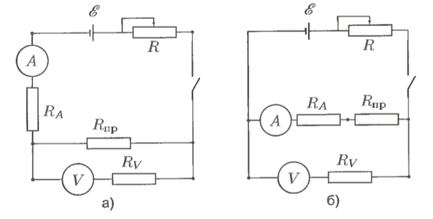

---
title:
    Определение систематических и случайных погрешностей при измерении удельного сопротивления нихромовой проволоки
subtitle:
    Лабораторная работа №1.1.1
author:
    Александр Нехаев, 654 гр.
output:
    pdf_document:
        toc: true
        number_sections: true
        latex_engine: pdflatex
        df_print: kable
        extra_dependencies:
            babel: ["russian", "english"]
            inputenc: ["utf8"]
            fontenc: ["T2A"]
---

# Цель работы
Измерить удельное сопротивление проволоки и выччислить систематические и
случайные погрешности при использовании таких измерительных приборов, как
линейка, штангенциркуль, микрометр, амперметр, вольтметр и мост постоянного тока.

# В работе используются
Линейка, штангенциркуль, микрометр, отрезок проволоки из нихрома, амперметр вольтметр, источник ЭДС, мост постоянного тока, реостат, ключ.

# Теоретическое введение
Удельное сопротивление материала проволоки круглого сечения, изготовленной из однородного материала и имеющей всюду одинаковую толщину, может быть определено по формуле:

$$
\rho=\frac{R_\text{пр}}{l}\frac{\pi d^2}{4}
$$

где $R_\text{пр}$ - сопротивление измеряемого отрезка проволоки, $l$ - eго длина, $d$ - диаметр проволоки.
Таким образом, для определения удельного сопротивления материала проволоки следует измерить длину, диаметр и величину электрического сопротивления проволоки.

Пусть $V$ и $I$ -- показания вольтметра и амперметра.
Рассчитанные по этим показаниям величины сопротивления проволоки $R_\text{пр1} = V_a/I_a$ для схемы (а) и $R_\text{пр2} = V_b/I_b$.



В первом случае вольтметр правильно измеряет падение напряжения на концах проволоки, а амперметр измеряет не величину прошедшего через проволоку тока, а сумму токов, проходящих через проволоку и через вольтметр.
Поэтому

$$
    R_\text{пр1} = \frac{V_a}{I_a} = R_\text{пр}\frac{R_V}{R_\text{пр}+R_V}
$$

Во втором случае амперметр измеряет силу тока, проходящего через проволоку, но вольтметр измеряет суммарное падение напряжения на проволоке и на амперметре.
В этом случае

$$
    R_\text{пр2} = \frac{V_b}{I_b} = R_\text{пр}+R_A
$$

Эти формулы удобно преобразовать.
Для схемы (а):
$$
    R_\text{пр} = R_\text{пр}\frac{R_V}{R_\text{пр}+R_V} = \frac{R_\text{пр1}}{1-(R_\text{пр1}/R_V)} \approx R_\text{пр1}\left(1+\frac{R_\text{пр1}}{R_V}\right)
$$

Для схемы (б):
$$
    R_\text{пр} = R_\text{пр2}\left(1+\frac{R_A}{R_\text{пр2}}\right)
$$

# Ход работы

```{r, echo=FALSE, include=FALSE}
# Importing packages & assigning libraries.
# Make sure that prepare_data.r program was succesfully executed before
# compiling this report
library(tidyverse)
library(tidymodels)
library(sassy)
library(knitr)
library(kableExtra)
library(errors)

libname(experimental, "./Physics_Labs/1_sem/Lab111/rmarkdown/data/experimental")
libname(meta, "./Physics_Labs/1_sem/Lab111/rmarkdown/data/meta")
```

Для расчета погрешностей будем использовать значения точностей измерительных приборов:
```{r, echo=FALSE}
meta$accuracy |>
kable(
    caption = "Точность измерительных приборов",
    col.names = c(
        "Инструмент",
        "Точность"
    )
)


```

1. Измеряем диаметр проволки на нескольких участках при помощи микрометра и штангенциркуля и рассчитываем средние значения c погрешностями. Результаты измерений представлены в таблице (4).

Кроме того, для подсчета средних величин и их погрешностей будем использовать формулы, приведенные ниже.

|Величина|Формула|
|--------|-------|
|Среднее значение|$\langle d \rangle = \frac{1}{N}\sum_{i = 1}^{n}x_i$|
|Случайная погрешность|$\sigma_{Random} = \frac{1}{N}\sqrt{\sum_{i=1}^{N}(d_i - \langle d\rangle)^2}$|
|Систематическая погрешность | $\sigma_{System} = \sqrt{\sigma_{Random}^2 + Accuracy^2}$
|Площадь сечения | $S = \frac{\pi d}{4}$ |
|Погрешность площади сечения | $\sigma_S = \sqrt{\left(\frac{\pi \langle d\rangle}{2}\right)^2 \cdot \sigma_{Random}^2}$ |

```{r, echo=FALSE}
experimental$diameter |>
kable(
    caption = "Результаты измерения диаметра проволоки",
    col.names = c("Штангенциркуль, мм", "Микрометр, мм")
)
```
По полученным значениям рассчитаем среднее значение диаметра проволоки, его погрешнгость и значение площади сечения с погрешностью:
```{r, echo=FALSE}
mean_diameters <-
    experimental$diameter |>
    pivot_longer(
        everything(),
        names_to = "tool",
        values_to = "val"
    ) |>
    mutate(
        tool = case_when(
            tool == "D1" ~ "Штангенциркуль",
            tool == "D2" ~ "Микрометр"
        )
    ) |>
    group_by(tool) |>
    summarize(
        mean = mean(val),
        sigmar = sqrt(sum((val - mean)**2)) / length(val),
        area = pi * mean(val)**2 / 4
    ) |>
    left_join(
        meta$accuracy,
        by = "tool"
    ) |>
    mutate(
        sd = sqrt(sigmar**2 + accuracy**2),
        sds = sqrt((pi * mean / 2)**2 * sigmar**2)
    )

mean_diameters |>
select(tool, mean, sigmar, sd, area, sds) |>
kable(
    caption = "Средние значения диаметра проволоки",
    col.names = c(
        "Инструмент",
        "Среднее значение, мм",
        "$\\sigma_{Random}$, мм",
        "$\\sigma_{System}$, мм",
        "Площадь сечения S, $\\text{мм}^2$",
        "$\\sigma_S$"
    )
)
```

2. Укажем основные харакстеристики приборов, используемых для снятия характеристик цепи:

```{r, echo=FALSE}
meta$characteristics |>
replace_na(
    list(milliammeter = "")
) |>
kable(
    caption = "Основные харакстеристики используемых стрелочных приборов",
    col.names = c(
        "Параметр",
        "Вольтметр",
        "Миллиамперметр"
    )
)
```
С их помощью и с информацией о том, что сопротивление проволоки по порядку величины составляет 5 Ом оценим поправки обоих методов согласно указанным в теоретическом введении формулам:
```{r, echo=FALSE, results='asis'}
method1 <- function(wire, rv) {
    wire * (1 + wire / rv)
}

method2 <- function(wire, ra) {
    wire * (1 + ra / wire)
}

cat(str_glue("$R_a = {method1(5, 10000)}$, $R_b = {method2(5, 1.2)}$."))
```
Таким образом выбираем схему 1.

3. С помощью линейки измеряем длину исследуемого участка и, собрав схему (а), снимаем показания амперметра и вольтметра:
```{r, echo=FALSE}
current <-
    experimental$current |>
    group_by(length) |>
    mutate(
        n = dplyr::row_number()
    ) |>
    pivot_wider(
        names_from = length,
        values_from = c(Vdel, V, I)
    ) |>
    select(c(Vdel_20, V_20, I_20, Vdel_30, V_30, I_30, Vdel_50, V_50, I_50))

kbl(
    current,
    "latex",
    col.names = c(
        "V, дел", "V, В", "I, А",
        "V, дел", "V, В", "I, А",
        "V, дел", "V, В", "I, А"
    ),
    caption = "Измерения напряжения и тока при помощи схемы."
) |>
    kable_classic() |>
    add_header_above(
        c("l = 20 см" = 3, "l = 30 см" = 3, "l = 50 см" = 3)
    )
```

Построим график зависимости $V(I)$ и по нему рассчитаем величину сопротивления $R$ и искомое значение $R_\text{пр}$.

```{r, echo=FALSE}
experimental$current |>
    ggplot(aes(x = I, y = V, color = length)) +
    geom_point() +
    geom_smooth(method = "lm", formula = y ~ 0 + x) +
    labs(
        x = "I, A",
        y = "V, B",
        title = "f = V(I)"
    ) +
    theme_bw()
```

Приведем результаты линейной регрессии, показанной на графике. На основе этих параметров можем рассчитать уже отдельно сопротивление проволоки. Так же укажем значения сопротивления, полученные при помощи моста Р4833:

```{r, echo=FALSE}
r_lm <-
    experimental$current |>
    group_by(length) |>
    group_modify(
        ~ tidy(lm(V ~ 0 + I, .x))
    ) |>
    select(-c(statistic, p.value)) |>
    mutate(
        length = as.numeric(length),
        r_pr = as.numeric(map(estimate, \(.x) method1(.x, 10000)))
    ) |>
    left_join(
        experimental$bridge,
        by = "length"
    )

r_lm |>
    kable(
        caption = "Параметры линейной регрессии и значения сопротивления",
        col.names = c(
            "Длина, см",
            "Параметр",
            "Значение, Ом",
            "Стандартная ошибка, Ом",
            "$R_\\text{пр}$, Ом",
            "$R_0$, Ом"
        )
    )
```

Как мы видим, величина стандартной ошибки достаточно мала и мы можем считать её примерно равной ошибке сопротивления проволоки.

Наконец, на основе полученных значений, рассчитываем удельное сопротивление:

```{r, echo = FALSE}

s <-
    mean_diameters |>
    select(c(area, sds)) |>
    mutate(
        minsd = min(sds)
    ) |>
    dplyr::filter(sds == minsd) |>
    pull(area)

sds <-
    mean_diameters |>
    pull(sds) |>
    min()

rho <-
    r_lm |>
    ungroup() |>
    mutate(
        rho = (r_pr / length) * s * 100,
        sigma_rho = sqrt((std.error / r_pr)**2 + (sds / s)**2 + (0.01 / length)**2) * rho
    ) |>
    select(c(rho, sigma_rho))

rho |>
    kable(
        col.names = c("$\\rho$", "$\\sigma_\\rho$")
    )
```

Получаем итоговое значение удельного сопротивления 

```{r, echo = FALSE, results='asis'}
result <-
    rho |>
    summarise(
        rho = round(mean(rho), digits = 2),
        sigma_rho = round(mean(sigma_rho), digits = 3)
    ) |>
    str_glue_data("$\\rho = ({rho}\\pm{sigma_rho}) \\cdot 10^{{-4}}$ Ом") |>
    as.character()
cat(result)
```