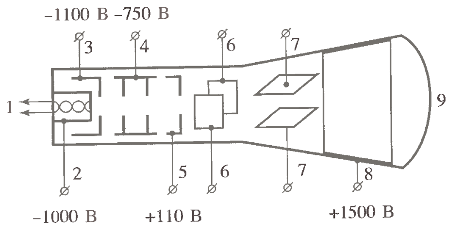

---
title:
    Изучение электронного осциллографа
subtitle:
    Лабораторная работа №1.1.6
author:
    Александр Нехаев, 654 гр.
output:
    pdf_document:
        toc: true
        latex_engine: pdflatex
        df_print: kable
        extra_dependencies:
            babel: ["english", "russian"]
            inputenc: ["utf8"]
            fontenc: ["T2A"]
---
# Цель работы
Ознакомление с устройством и работой осциллографа и изучение его основных характеристик.

# В работе используются
Осциллограф, генераторы электрических сигналов, соединительные кабели.

# Теоретическая часть



Трубка представляет собой стеклянную откачанную до высокого вакуума колбу, в которой расположены (рис. \ref{fig1}):

1. Подогреватель катода
2. Катод
3. Модулятор (электрод, управляющий яркостью изображения)
4. Первый (фокусирующий) анод
5. Второй (ускоряющий) анод
6. Горизонтально отклоняющая пластина
7. Вертикально отклоняющая пластина
8. Третий (ускоряющий) анод
9. Экран

Чувствительность трубки к напряжению:

$$
    k = \frac{l_1 L}{2 d U_a},
$$

где $l_1$ -- длина пластин, $L$ -- расстояние от середины пластин до экрана, $d$ -- растояние между пластинами, $U_a$ -- ускоряющее напряжение на втором аноде.

Подаваемое на вертикально отклоняющие пластины напряжение должно быть пропорционально самому сигналу:
$$
    U_y(t) = U_{0y} + k_{yu} U_c(t),
$$
$U_{0y}$ -- постоянное напряжение, определяющее расположение сигнала по оси $Y$, $k_{yu}$ -- коэффициент преобразования входного сигнала каналом вертикального отклонения.

Подаваемое на горизонтально отклоняющие пластины напряжение должно линейно зависеть от времени:
$$
    U_x(t) = U_{0x} + k_{xu} t
$$
$U_{0x}$ -- постоянное напряжение, определяющее расположение сигнала по оси $X$, $k_{xu}$ -- коэффициент пропорциональности, зависящий от рабочих характеристик генератора развертки и усилителя.

## Фигуры Лиссажу
Напряжение на горизонтальной пластине: $U_x = U_a \cos(2 \pi f t + \varphi_1)$.

Напряжение на вертикальной пластине: $U_y = U_b \cos(2 \pi f t + \varphi_2)$.

Уравнение траектории движения луча: $\frac{x^2}{A^2} + \frac{y^2}{B^2} - 2 \frac{x y}{A B}\cos(\varphi_2 - \varphi_1)=\sin^2(\varphi_2 - \varphi_1)$.
```{r, echo=FALSE, include=FALSE}
# Importing packages & assigning libraries.
# Make sure that prepare_data.r program was succesfully executed before
# compiling this report
library(tidyverse)
library(tidymodels)
library(sassy)
library(knitr)
library(kableExtra)
library(errors)

libname(experimental, "./Physics_Labs/1_sem/Lab116/rmarkdown/data/experimental")
```
# Ход работы
Результаты измерений частоты синусоидального сигнала:
```{r, echo=FALSE}
generator <-
    experimental$generator |>
    mutate(
        tc = t * c,
        f = 1 / tc,
        df = abs(fzg - f)
    )

generator |>
    kable(
        col.names = c(
            "$f_{\\text{зг}}$, Гц",
            "$T$, дел",
            "с/дел",
            "$T$, с",
            "$f$, Гц",
            "$abs(f-f_{\\text{зг}})$, Гц"
        )
    )
```

Измерение амплитудно-частотной характеристики осциллографа:
```{r, echo=FALSE}
afc <-
    experimental$afc |>
    mutate(
        logf = log(f),
        Kac = Uac / 6,
        Kdc = Udc / 6
    ) |>
    select(c(f, logf, Uac, Kac, Udc, Kdc))

afc |>
    kable(
        col.names = c(
            "$f$, Гц",
            "$\\log(f)$",
            "$2 U_{ac}$, дел",
            "$K_{ac}$",
            "$2 U_{dc}$, дел",
            "$K_{dc}$"
        )
    )
```

Строим графики $K_{ac}$, $K_{dc}$ от $\log(f)$:

```{r, echo=FALSE}
afc |>
    ggplot(aes(x = logf, y = Kac)) +
    geom_point() +
    theme_bw()

afc |>
    ggplot(aes(x = logf, y = Kdc)) +
    geom_point() +
    theme_bw()
```

Измерение разности фазово-частотных характеристик каналов осциллографа:
```{r, echo=FALSE}
pfc <-
    experimental$pfc |>
    mutate(
        logf = log(f),
        dphi = asin(y0 / Ay)
    ) |>
    select(c(f, logf, y0, Ay, dphi))

pfc |>
    kable(
        col.names = c(
            "$f$, Гц",
            "$\\log(f)$",
            "$2 y_0$, дел",
            "$2 A_y$, дел",
            "$\\Delta \\varphi$"
        )
    )
```

Строим график $\\Delta \\varphi(\\log(f))$:

```{r, echo=FALSE}
pfc |>
    ggplot(aes(x = logf, y = dphi)) +
    geom_point() +
    geom_line() +
    theme_bw()
```